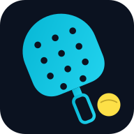
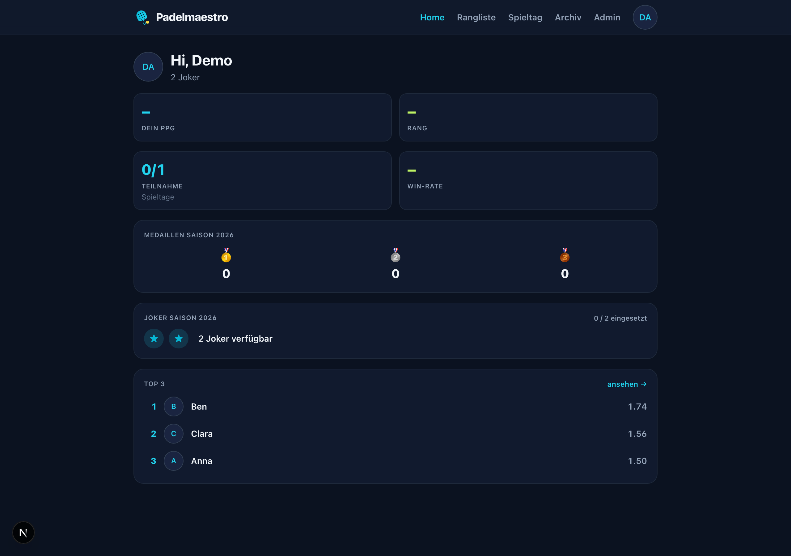
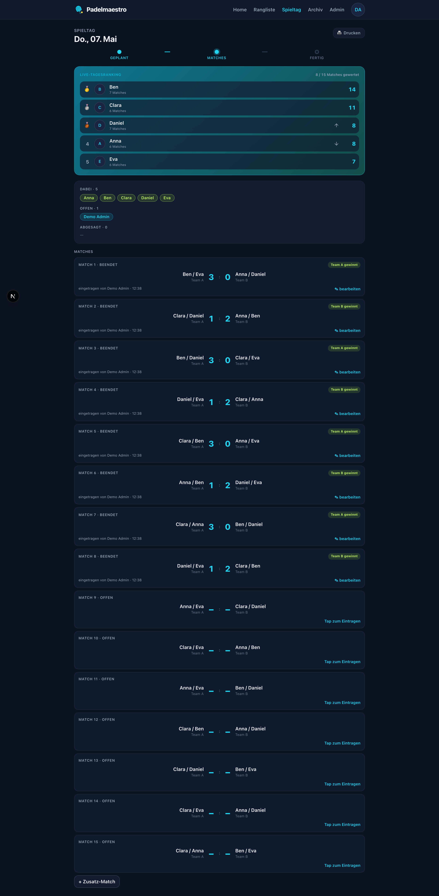
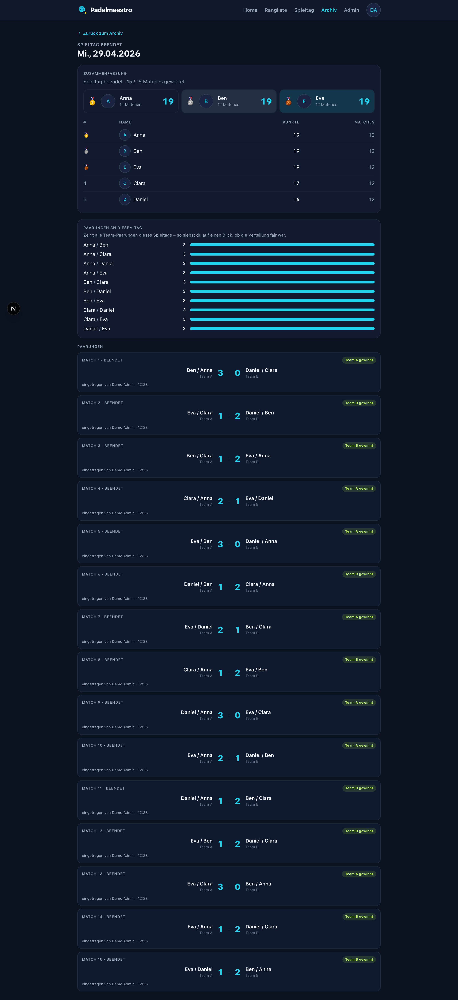
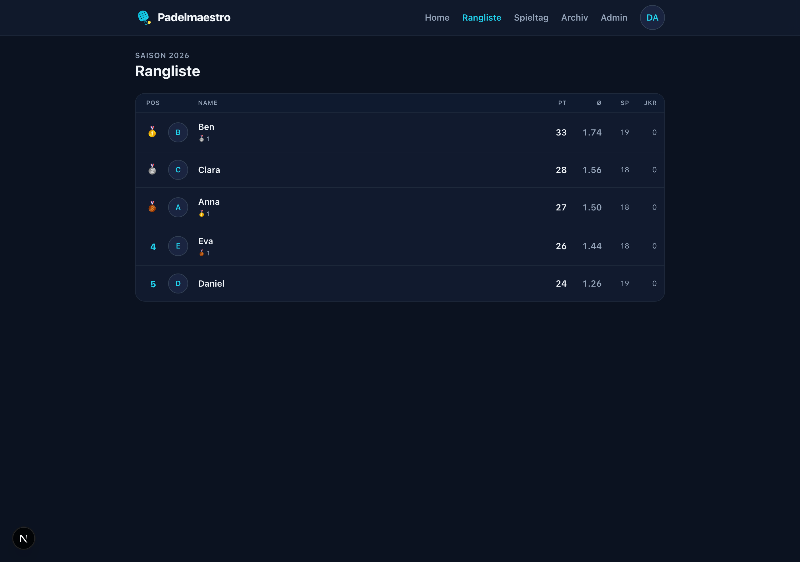
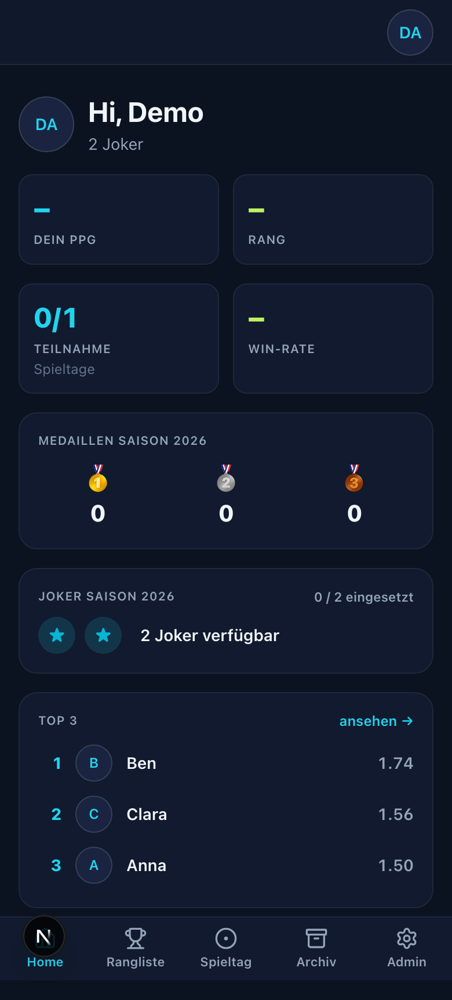
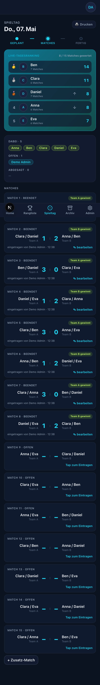
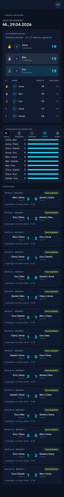
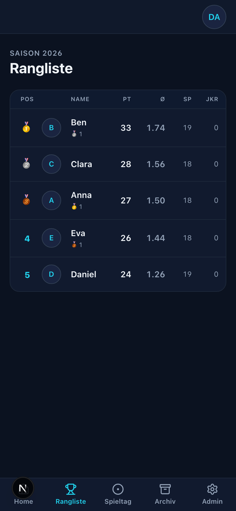

<div align="center">
  
  <h1>Padelmaestro</h1>
  <p>
    <strong>The web app that runs your Tuesday-night padel sessions.</strong><br/>
    Replaces the paper scoresheets and the XLSX ranking with a live, mobile-first PWA — balanced pairings, real-time scoring, season-long ranking with a Joker mechanic.
  </p>
  <p>
    
    
    
    
    
    
    
    
    
  </p>
</div>

---

## What it does

A live game-day flow for 4–6 players. The admin opens a session, players confirm or pick a Joker before the deadline, the schedule generator builds a balanced 10–15 match plan, and everyone enters scores from their phone in real time. After the day is finished, the app shows the podium, the leaderboard, and how often each pair partnered as a team.

## Highlights

| | |
|:--|:--|
| 🏆 **Live game day** with SSE updates — no manual reload, every score lands on every phone within ~1 s | 📊 **Season ranking** sorted by points-per-game, with three medals on the season podium and per-day medals in the dashboard |
| 🃏 **Joker** mechanic with PPG-snapshot — 2 per season, locked once the roster locks | 🤝 **Partner-frequency view** on every finished day to surface fairness of pairing distribution |
| 📱 **Installable PWA** — Add-to-Home-Screen banner on iOS Safari, native install prompt on Chromium | 🔐 **Auth.js v5 credentials** with bcrypt password hashing, optimistic locking on score writes |
| 🖨️ **Printable scoresheet** for the admin in case the venue Wi-Fi is down | 📥 **Historical importer** to migrate years of XLSX data into a clean Postgres season |

## Screenshots

<table>
<tr>
  <td align="center" width="50%">
    <br/>
    <sub><b>Dashboard</b> — next game day, your attendance, the season-progress card</sub>
  </td>
  <td align="center" width="50%">
    <br/>
    <sub><b>Game day in progress</b> — live tagesranking banner, match cards with inline score entry</sub>
  </td>
</tr>
<tr>
  <td align="center" width="50%">
    <br/>
    <sub><b>Finished day</b> — podium, full leaderboard, partner-frequency bars, every match</sub>
  </td>
  <td align="center" width="50%">
    <br/>
    <sub><b>Season ranking</b> — points-per-game leaderboard with medals and Joker hints</sub>
  </td>
</tr>
</table>

### On mobile

<table>
<tr>
  <td align="center"></td>
  <td align="center"></td>
  <td align="center"></td>
  <td align="center"></td>
</tr>
</table>

## Tech stack

- **Next.js 15** App Router with React 19 server components
- **TypeScript** with strict mode and zero `any`
- **Tailwind CSS 4** with custom design tokens
- **Prisma 6** on **PostgreSQL 16**
- **Auth.js v5** (credentials provider, JWT sessions)
- **In-process SSE** pub/sub for live game-day updates (single-Node deploy; swappable for Redis pub/sub if we ever scale out)
- **Vitest 4** for unit + integration tests, **Playwright** for end-to-end multi-user scenarios

## Quick start

You will need **Node.js 22 LTS**, **pnpm 9+**, and **Docker** for local Postgres.

```bash
# 1. Install dependencies
pnpm install

# 2. Local env (copy and fill in AUTH_SECRET via `openssl rand -base64 32`)
cp .env.example .env

# 3. Postgres
docker compose -f docker-compose.dev.yml up -d
pnpm db:migrate

# 4. Bootstrap your first admin (prints a temporary password)
pnpm bootstrap:admin you@example.com "Your Name"

# 5. (Optional) seed five demo players to play with
pnpm seed:demo

# 6. Start the dev server
pnpm dev
```

Open <http://localhost:3000> and log in.

## Common tasks

```bash
pnpm test                 # full Vitest suite (unit + integration)
pnpm test:watch           # watch mode
pnpm lint                 # next lint
pnpm e2e                  # multi-user Playwright driver (needs E2E_ADMIN_EMAIL/PASSWORD env)
pnpm db:reset             # nuke and reseed the local DB
pnpm import:historical    # import a years-old XLSX into a clean season (see docs/import-historical.md)
```

## Project layout

```
prisma/                  schema + migrations
src/app/                 App Router pages and route handlers
src/lib/                 pure logic — pairings, match validation, ranking, joker, auth
src/components/          shared UI (BottomTabs, Avatar, Stepper, …)
tests/unit/              pure-logic tests (Vitest, no DB)
tests/integration/       DB-backed tests (Vitest + Docker Postgres)
tests/e2e/               multi-user Playwright driver
scripts/                 one-off CLI helpers (seed, bootstrap, import)
docs/                    deployment notes, onboarding HTML, design specs
```

## Roadmap

- [x] Phase 1 — invitation + password auth, attendance, balanced pairings, score entry with optimistic locking, season ranking, Joker (2/season, PPG snapshot)
- [x] Phase 2 — live SSE updates, printable scoresheet, extra-match flow
- [x] Phase 3 — installable PWA (manifest, icons, install banner), partner-frequency view
- [ ] Pairing template generator that maximizes partner-coverage fairness within a single day
- [ ] Telegram bot for attendance reminders
- [ ] Per-player long-term stats page (head-to-head, partner affinity, joker history)

## License

Private. Not licensed for public reuse.
